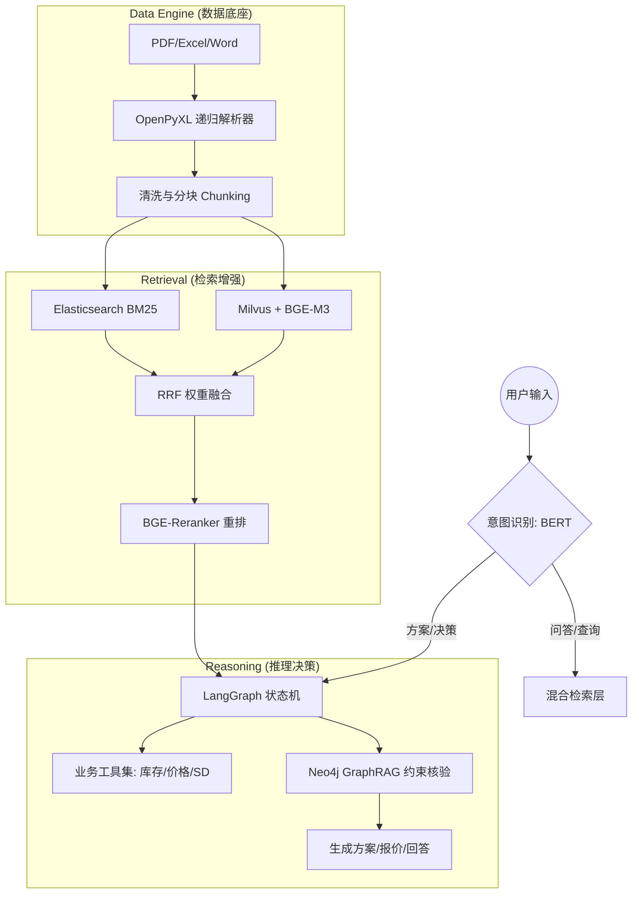

# Furniture-RAG-System
## 家居垂直场景 RAG 智能决策系统

本项目旨在解决家居/建材垂直领域中：**复杂非结构化文档解析难**、**产品型号无语义召回低**、以及**业务逻辑约束失调（如材质与场景冲突）**等核心痛点。通过从"向量检索"到"图增强检索"的演进，实现"设计即报价"的业务闭环。

---

## 🏗️ 全链路系统架构 (System Architecture)

---

## 📊 核心技术指标

| 优化项 | 优化前 | 优化后 |
|--------|--------|--------|
| Excel合并单元格解析准确率 | 42% | 88% |
| 产品型号查询召回率 | 34% | 91% |
| Reranker P99 响应延迟 | 480ms | 160ms |
| 客户咨询响应时间 | 15分钟 | 30秒内 |

---

## 🔧 核心技术攻坚 (Technical Deep Dive)

### 1. 复杂 Excel 嵌套表头递归解析
- **核心挑战**：经销商价格台账存在大量跨行列合并单元格，传统解析导致数据错位，解析准确率仅 42%
- **方案**：编写 `openpyxl` 递归遍历逻辑，通过坐标映射自动回填合并单元格子值，逐层展平嵌套表头
- **业务价值**：解析准确率提升至 88%，为后续 RAG 检索提供高质量数据源

### 2. BGE-M3 混合检索与 RRF 融合
- **核心挑战**：产品型号（如 HX-2023-B）在语义空间分布稀疏，向量检索召回率仅 34%，业务不可用
- **方案**：BGE-M3 稠密检索 + Elasticsearch BM25 稀疏检索双路并行，RRF 算法融合排序
- **业务价值**：型号召回率从 34% 提升至 91%

### 3. LangGraph 有状态状态机
- **核心挑战**：线性 ReAct Agent 无法处理"风格-材质-成本"三者循环冲突，单轮对话无法收敛
- **方案**：弃用线性 Chain，重构为 LangGraph 多节点状态机，引入自反思节点循环校验
- **演进方向**：引入 Neo4j 图数据库路径校验，确保输出方案符合材质兼容性约束

---

## 🛠️ 技术栈与存储架构 (Tech Stack)

| 模块 | 技术选型 | 关键参数/逻辑 |
|------|---------|--------------|
| **LLM 基座** | Qwen-2.5-7B/14B | 垂直领域 LoRA 指令对齐 |
| **Embedding** | BGE-M3 | 支持多粒度特征检索 |
| **向量数据库** | Milvus | IVF_FLAT / HNSW 混合索引 |
| **稀疏检索** | Elasticsearch | BM25 强匹配算法 |
| **状态机框架** | LangGraph | 节点自反思与循环校验 |
| **图数据库** | Neo4j | 材质约束知识图谱 |
| **接口层** | FastAPI | Webhook 对接企微/钉钉 |
| **前端界面** | Streamlit | 可视化调试界面 |

---

## 🐛 生产环境踩坑记录 (Pitfalls & Lessons)

**坑1：Milvus 批量写入导致 OOM**
- 解决：Generator 分批读取（每批500条）+ 动态连接池配置，吞吐量提升约3倍

**坑2：Reranker 长 Query 延迟暴涨**
- 解决：Query 动态截断至 64 token + 高频热点结果缓存，P99 延迟稳定在 160ms 以内

**坑3：Agent 复杂决策下 Token 溢出**
- 解决：升级为 LangGraph 状态机，定义 `max_iterations=5` 并在节点间进行状态精简

---

## 📁 项目结构 (Project Structure)
```text
furniture-rag-system/
├── data/              # 脱敏后的语料与 Excel 模板
├── src/
│   ├── parser/        # OpenPyXL 递归解析模块
│   ├── retrieval/     # 混合检索与 RRF 融合引擎
│   ├── graph/         # Neo4j 知识图谱构建脚本
│   └── agent/         # LangGraph 状态机定义
├── app.py             # Streamlit 演示 Demo
└── requirements.txt
```
---

## ⚙️ 快速开始
```bash
git clone https://github.com/arisdeepmind/furniture-rag-system.git
cd furniture-rag-system
pip install -r requirements.txt
```

> 注：运行需配置 Milvus、Elasticsearch 环境，详见各模块说明。
